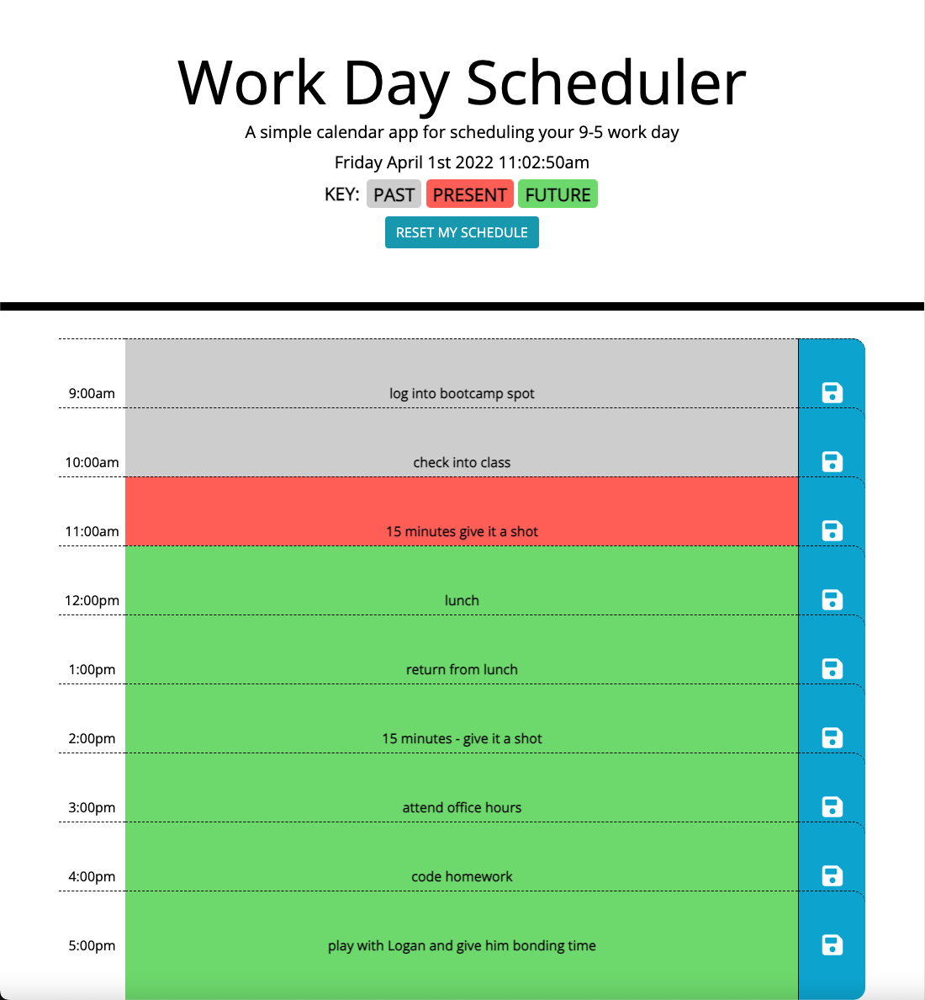

# Day-Planner
A simple day planner application that uses Moment.js to plan n 8 hour work day.

## Installation

This is a browser application. Simply visit the launched page.  
[The live page with the web application](https://rowe2ry.github.io/Day-Planner/)

## Usage

The application is fairly simple and includes a key to guide you through the day. Simply click in any of the time block where there is currently a message telling you that you may click to edit. Write what you want to do in that hour of the day, and click the save icon next to your input. Feel free to re-visit the page throughout the day to check or update your schedule, as it will remember what you entered in, provided you do not clear your browsing history, cache, cookies, or have been using private/incognito browsing modes. The schedule is saved to your computer on the browser you used, so you will NOT be abel to access the schedule on a different device. If you do the same thing every day, the app is going to load with the previous day's schedule already the next day. If you need a clean slate, simply click the reset button and confirm "ok" in the pop up window.

## Contributing
Pull requests are welcome. For major changes, please open an issue first to discuss what you would like to change.

Please make sure to update tests as appropriate.

## License
[MIT](https://choosealicense.com/licenses/mit/)